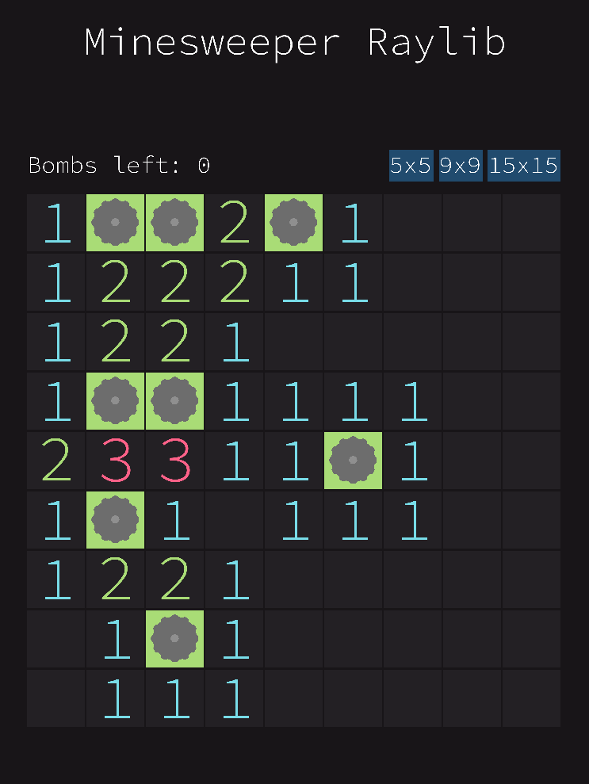
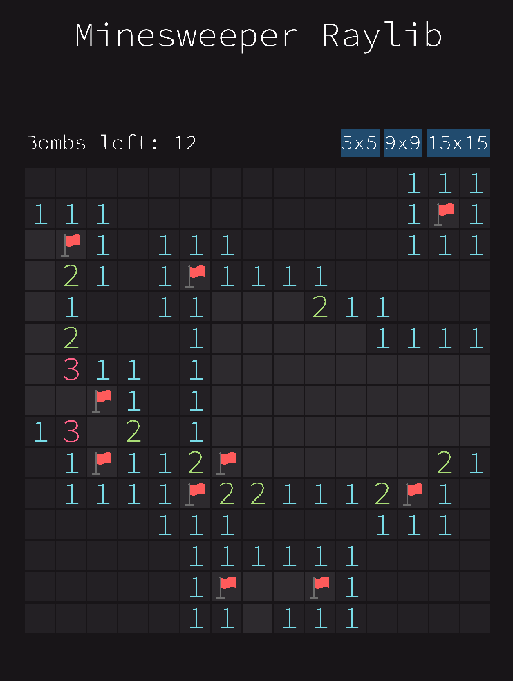

# Minesweeper Raylib

A Minesweeper game built with Raylib and C++. It features a graphical user interface (GUI) and allows users to play the classic game with different grid sizes.

## Features
- **Multiple Grid Sizes**: Play on 5x5, 9x9, or 15x15 boards.
- **Graphical User Interface**: Rendered using Raylib.
- **Bomb Counter**: Displays the number of remaining bombs.

## Installation
### Requirements
- A C++ compiler (e.g., MinGW, MSVC, Clang, or GCC)
- Raylib (installed as a precompiled library or compiled from source)

## Controls
- **Left Click**: Reveal a cell
- **Right Click**: Flag a cell
- **Grid Size Buttons**: Switch between different board sizes

## Dependencies
- **Raylib** (https://www.raylib.com/)

## Screenshots

